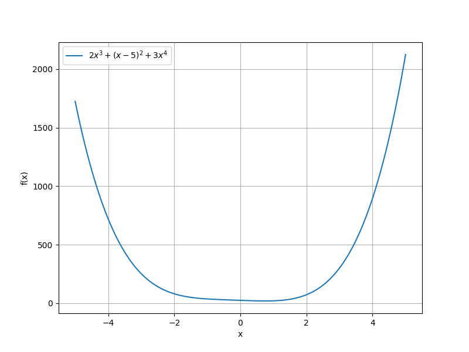
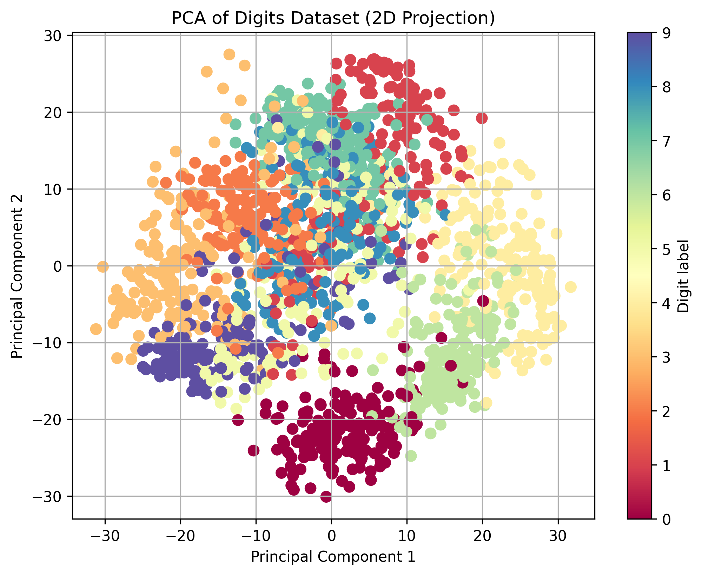

# 第一次作业

## 实验1

用`Matplotlib`绘制一个2x^3+(x-5)^2+3x^4并用`Scipy`求解其最小值

```python
import numpy as np
import matplotlib.pyplot as plt
from scipy.optimize import minimize


def func(x):
    return 2 * x**3 + (x - 5) ** 2 + 3 * x**4


x_vals = np.linspace(-5, 5, 400)
y_vals = func(x_vals)
plt.figure(figsize=(8, 6))
plt.plot(x_vals, y_vals, label=r"$2x^3 + (x-5)^2 + 3x^4$")
plt.xlabel("x")
plt.ylabel("f(x)")
plt.grid(True)
plt.legend()

plt.savefig("result.png")

result = minimize(func, x0=0)
print(result.x[0], result.fun)
```



## 实验2

用sklearn 中的decomposition模块对sklearn中自带的手写数字数据集调用方法load_digits进行PCA降维将维度降为2 并用matplotlib绘制散点图

```python

from sklearn.decomposition import PCA
from sklearn.datasets import load_digits
import matplotlib.pyplot as plt

digits = load_digits()
X = digits.data
y = digits.target


pca = PCA(n_components=2)
X_pca = pca.fit_transform(X)

plt.figure(figsize=(8, 6))
scatter = plt.scatter(X_pca[:, 0], X_pca[:, 1], c=y, cmap="Spectral", s=50)
plt.title("PCA of Digits Dataset (2D Projection)")
plt.xlabel("Principal Component 1")
plt.ylabel("Principal Component 2")
plt.colorbar(scatter, label="Digit label")
plt.grid(True)


plt.savefig("image2.png", dpi=300, bbox_inches="tight")  
```


